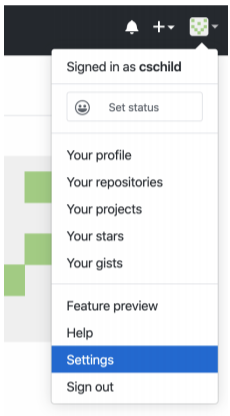
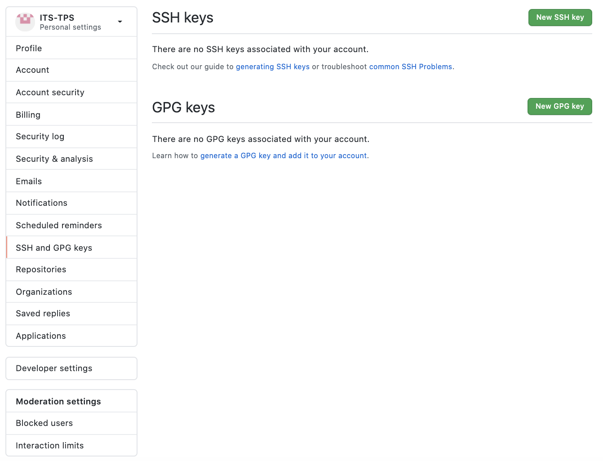
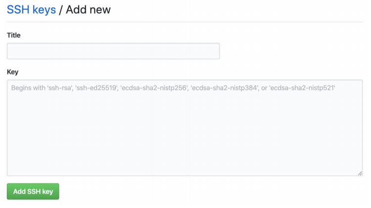

# Quick Setup
`apt install git` not tested
## Générer une Nouvelle clé SSH 
POURQUOI => Todo
### Quick and Dirty
`ssh-keygen` *enter* *enter* *enter* *enter*
### Méthode la plus complète 
1. Crée une clée ssh
`ssh-keygen -t rsa -b 4096 -C "your_email@example.com"`
1. Lorsqu'on vous demande "Enter a file in which to save the key", entrer `~/.ssh/id_rsa_github`
2. Lorsque la demande de passphrase apparait, vous pouvez appuyez sur la touche
"entrée".

4. Ouvrer le fichier de config avec vi `vi ~/.ssh/config`.
5. Pour pouvoir modifier le fichier tapper `i` et entrer les configuration suivantes :
```sh
Host github.com
        HostName github.com
        User git
        IdentityFile ~/.ssh/id_rsa_github
        IdentitiesOnly yes
```
6. Appuyer sur la touche `esc`pour quitter le mode d'édition. 
7. Pour enregistrer les modifications et quitter `vi` tapper `:wq`
   * `w` enregistre les modifications
   * `q` quitte `vi`
## Ajout clef gitlab
TODO
## Ajouter une clé SSH à votre compte GitHub
1. Copier la clé publique dans le presse papier avec
`pbcopy < ~/.ssh/id_rsa_github.pub` (si cela ne marche pas afficher la clé avec `cat ~/.ssh/id_rsa_github.pub` et copier tout ce qui est affiché)
2. Dans le coin droit de la page GitHub, cliquer sur votre profil photo, puis dans **Settings.**
<div align="center">
    
</div>

3. Dans la barre latérale, cliquer sur **SSH et GPG keys**.
<div align="center">
    
</div>


4. Dans le champ "Title", ajouter un label descriptive pour la nouvelle clé. Par exemple
si vous utilisé un Mac, vous pouvez l’appeler MacBook.
<div align="center">
    
</div>

5. Coller la clé copiée en 1) dans le champ "Key". (pas obliger de tout envoyer)
6. Confirmer le mot de passe GitHub (si demandé).


# Exemple d'utilisation
## Télécharger le projet
```sh
#Download le "code"
git clone git@[github|gitlab].com:[username]/[repos-name].git
```
## Crée son projet
Mensonge le faire a la main ! !! ! !
```sh
#Download le "code"
git init [repos-name]
```

```sh
# déplace dans le dépeaux
cd [repos-name]

# crée une nouvelle branche
git checkout -b [fonctionalitée de la branche]

# Codez votre fonction !

# où j'en suis ?
git status

# tracking de nouveaux fichier
git add . || git add [liste fichier en rouge] || git add -A

# Sauvegarde et documente ce que j'ai fait
git commit -m "[Où ça] [Quoi]"

# j'envoie ce que j'ai fait
git push origin [nom de votre branche]

# j'import les modification distante
git pull origin master

# fusion branche
git merge [nom de votre branche]

# si conflit: regarder VSCODE
```

# Commande utile :
## Je veux son code:
`git clone git@github.com:pseudo/nom_projet.git` : permet de récupérer un repository git sur son ordinateur
un repos peut être un dossier => TODO
## Ajout de nouveaux fichier:
il faut indiquer a git qu'il faut tracker les fichier
`git add [paths]` : permet d'ajouter des fichiers à la liste des fichiers "suivis"
attention de ne pas tout ajouter, BIN vs SRC

## Blacklist gitignore
fichier qui blacklist a git les fichier générée
prend des token ect
## CTRL+S !
`git commit -m [message]` : permet de sauvegarder les fichiers suivis localement (non accessible pour les autres). Le message doit décrire la sauvegarde (choisissez des noms pertinents).
## J'envoi au copain !
`git push origin [branch]` : envoie les sauvegardes locales sur le repository distant (accessible aux autres).
## Nouvelle fonctionaliter !
`git branch [branche name]` : créer une nouvelle branche locale (elle sera disponible pour les autres au premier git push origin [nom de la branche]).

## ces quoi les branche ?
`git branch` : affiche les branches présentes en local.
## Téléportation !
`git checkout [branch]` : change votre branche de travail.
## J'en fait ma nouvel branche
`git checkout -b [branch]` : créer une nouvelle branche et bascule immédiatement sur celle-ci.
## Prudance (je me méfie de ce qu'on fait mes collèque)
`git fetch` : récupère les branches distantes qui n'existent pas en local (après cette commande, on peut basculer sur ces branches) ainsi que les modifications effectuées sans les fusionner.
## que ce passe t'il
IMPORTANT => why 
`git status` : indique quels fichiers vont être sauvegardés localement (en vert) et ceux qui ne le seront pas (en rouge).
## que ces t'il passer
attention etre sur la bonne brnache

`git log --abbrev-commit` : affiche la liste des derniers commits.

`git checkout [sha du commit]` : retourne sur le commit donné en lecture.

## On oublie tout j'usqua [ICI]
`git reset --hard [sha du commit]` : retourne sur le commit donné. Comme si les commits suivant avaient été effacés.

## Delet la branche
`git branch -D [nom de la branche]` : supprime localement la branche.

## delet branch sur le dépeaux ?
`git push origin --delete [nom de la branche]` : supprime la branche distante.

`git merge [nom de la branche]` : fusionne 2 branches. Celle dans laquelle vous vous trouver est la branche qui sera modifiée.

## je commance a travailler
commende pour check les diff

# Astuces utiles

git show-branche : list les dépendance des branche au commit
git rm --cached: remove a file from track list
git merge --abort : cancel un merge

git mergetool: use for merging 
gitk --all : show les tt les branch and dep 
git clean: use for clean untrack file

`git add .` : ajoute tous les fichiers modifiés du répertoire courant (ainsi que ceux les sous-répertoires) aux fichiers suivis.

`git add -A` : ajoute tous les fichiers modifiés depuis le dernier commit aux fichiers suivis.


`git reset HEAD~[nb de commit] --soft` : annule les nb de commit derniers commits sans perdre le code actuel.

`git reset HEAD~[nb de commit] --mixed` : annule les nb de commit derniers commits et annule le add sans perdre le code actuel.

`git reset --hard` : annule toutes les modifications et revient au commit actuel.

`git reset HEAD~[nb de commit] --hard` : revient nb de commit commits en arrière et supprime le code associé.

[Si vous avez un problème, ce lien pourrait être utilise.](https://ohshitgit.com/)

Annuler des commits:
`git reset HEAD~[nb de commit] --hard`
`git push origin +[nom branche]` : le '+' n'est pas une erreur et est obligatoire.

# Setup

### avoir accès au configuration
git config --local --global --get


git push --set-upstream origin docs

To have this happen automatically for branches without a tracking
upstream, see 'push.autoSetupRemote' in 'git help config'.

## si clef privée spécifique:

### premier clone:
git va utiliser la variable temporairement pour savoir comment utiliser ssh avec quelle clef.  

    GIT_SSH_COMMAND="ssh -i ~/.ssh/[privkey]" git clone git@[domainename]:[username]/[project].git

### pour tout le projet:

    git config core.sshCommand="ssh -i ~/.ssh/[privkey]"

## publier chaque nouvelle branche automatiquement:
git config --global push.autosetupremote true
## git config pull.*:
### Merge:
good for collaborative projects where multiple people are working on different parts of the code and need to merge their changes into a central repository.
### Rebase:
good for individual projects where you want to keep a clean, streamlined history of changes without cluttering it with merge commits.
### Fast-orward only:
good for situations where you know there are no conflicts between the two branches being merged and you want to keep a very clean and concise history of changes.


# erreur commune

## conflic merge
    Auto-merging main.c
    CONFLICT (content): Merge conflict in main.c
    Automatic merge failed; fix conflicts and then commit the result.
oui il va faloir travailler est lire **religieusement** ce qu'on fait les collègue ... 
## git switch
    error: Your local changes to the following files would be overwritten by checkout:
            README.md
    Please commit your changes or stash them before you switch branches.
    Aborting
### traduction:
vous n'avez pas enregistrer votre document avant d'en ouvrire un autre.

- git stash => fout de cotée les modif
- git reset --hard =>
- commit => 

## git push new branch
    git push --set-upstream origin docs

    To have this happen automatically for branches without a tracking
    upstream, see 'push.autoSetupRemote' in 'git help config'. 
### git push en retard
    ! [rejected]        pullmerge -> pullmerge (non-fast-forward)
    error: failed to push some refs to 'git.unistra.fr:louisduval/git_forma_conflict.git'
    hint: Updates were rejected because the tip of your current branch is behind
    hint: its remote counterpart. Integrate the remote changes (e.g.
    hint: 'git pull ...') before pushing again.
    hint: See the 'Note about fast-forwards' in 'git push --help' for details.
## pas de branche master
il n'y a jamais eux de commit...


https://ohshitgit.com/#accidental-commit-master

https://ohshitgit.com/#accidental-commit-wrong-branch


git ls-tree -r HEAD --name-only


    feat: for new features or functionality added to the project
    fix: for bug fixes
    docs: for documentation updates or additions
    style: for changes to the project's style or formatting (e.g. CSS, formatting, etc.)
    refactor: for changes to the code that do not add new features or fix bugs, but improve the structure or readability of the code
    test: for changes to the project's testing framework or tests
    chore: for changes to the build process or other tasks that do not affect the code itself (e.g. updating dependencies, configuring tools, etc.)


## comment ce brancher a un projet
from gitlab
### Create a new repository
```
git clone git@[repo_domaine]:[username]/[project_name].git
cd [project_name]
git switch -c main
touch README.md
git add README.md
git commit -m "add README"
git push -u origin main
```

### Push an existing folder
```
cd existing_folder
git init --initial-branch=main
git remote add origin git@[repo_domaine]:[username]/[project_name].git
git add .
git commit -m "Initial commit"
git push -u origin main
```

#### Push an existing Git repository
```
cd existing_repo
git remote rename origin old-origin
git remote add origin git@[repo_domaine]:[username]/[project_name].git
git push -u origin --all
git push -u origin --tags
```

#### salty linus
https://www.phoronix.com/news/Linus-Torvalds-Git-Merge-Wisdom